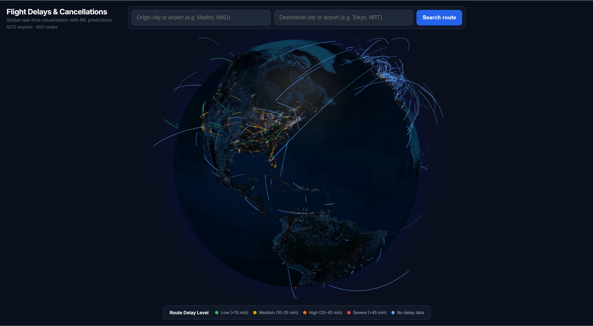
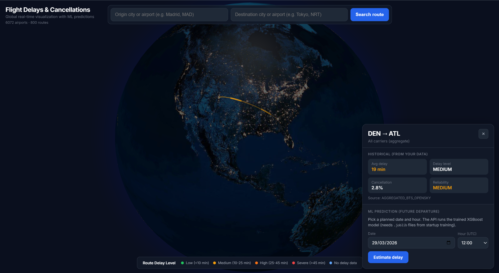
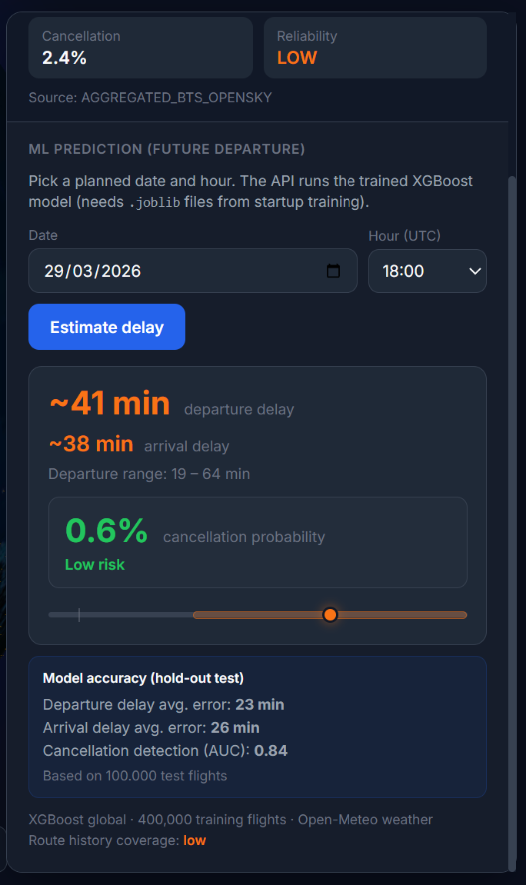

# 🌍 Flight Delays & Cancellations Predictor


> **Stop guessing at the gate. Start predicting with data.**

Every day, thousands of flights are delayed or canceled, costing passengers time and airlines money. While we can't control the weather or air traffic, we *can* predict how they will affect your journey. 

This project is a **Global Real-Time Visualization and Machine Learning Prediction Platform** for flight delays and cancellations. It combines a stunning 3D interactive globe with a XGBoost predictive engine to give you unprecedented insights into global flight reliability.

---

## ✨ Features

### 1. The Global Picture


Get a bird's-eye view of the world's flight network. The interactive 3D globe visualizes thousands of airports and routes. Routes are color-coded based on their historical and predicted delay levels, allowing you to instantly spot global congestion and weather-impacted regions.

### 2. Route Deep-Dive


Select any specific route (e.g., Denver to Atlanta) to instantly access its historical performance. We aggregate data across all carriers to give you the raw truth about a route's average delay, cancellation rate, and overall reliability.

### 3. Machine Learning Predictions


Planning a future trip? Pick a date and time, and our ML engine goes to work. It doesn't just give you a generic average; it provides a tailored prediction including:
- Estimated Departure & Arrival Delays (in minutes)
- Delay Range (Confidence Intervals)
- Cancellation Probability Risk

---

## 🧠 How It Works: Under the Hood

To provide accurate predictions, the system relies on a robust data pipeline and advanced machine learning techniques.

### 📊 The Data Sources
We don't rely on a single source of truth. The platform aggregates massive datasets to build a comprehensive view of the skies:
- **Historical Flight Data:** Aggregated from the **Bureau of Transportation Statistics (BTS)** and **OpenSky Network**. This provides the baseline for how specific routes and airlines perform historically.
- **Weather Integration:** Weather is the #1 cause of delays. We integrate with **Open-Meteo** to pull historical and forecasted weather data (wind speed, precipitation, storms) for both the origin and destination airports at the exact hour of the flight.

### 🤖 The Predictive Engine (XGBoost)
At the core of the backend is a highly optimized **XGBoost** model, trained on hundreds of thousands of flights. 

**How does it calculate the delay?**
1. **Feature Engineering:** When you request a prediction, the API constructs a feature vector that includes the time of day, day of the week, seasonality, route distance, historical carrier performance, and the forecasted weather conditions at both ends of the journey.
2. **Non-linear Pattern Recognition:** The XGBoost trees evaluate how these factors interact. For example, a little rain in Miami might not cause a delay, but the same amount of rain in Denver combined with high winds and a Friday evening departure might trigger a cascade of delays.
3. **Output Generation:** The model outputs continuous values for expected departure/arrival delays and a probability score (AUC) for the likelihood of a cancellation.

---

## 🛠️ Tech Stack

- **Frontend:** React, Vite, Globe.gl (for high-performance 3D WebGL rendering), TailwindCSS.
- **Backend:** Python, FastAPI (for lightning-fast prediction serving), Pandas, Scikit-Learn.
- **Machine Learning:** XGBoost.
- **Infrastructure:** Docker & Docker Compose for seamless containerized deployment.

---

## 🚀 Getting Started

Want to run the globe and the ML API locally? The entire stack is containerized for easy setup.

1. **Clone the repository**
2. **Run with Docker Compose:**
   ```bash
   cd flight-delays
   docker-compose up --build
   ```
3. **Access the App:**
   - Frontend: `http://localhost:80` (or your configured port)
   - Backend API Docs: `http://localhost:8000/docs`

*(Note: The ML model requires initial `.joblib` files generated during the startup training phase).*

---
*Built to make the skies a little more predictable.*